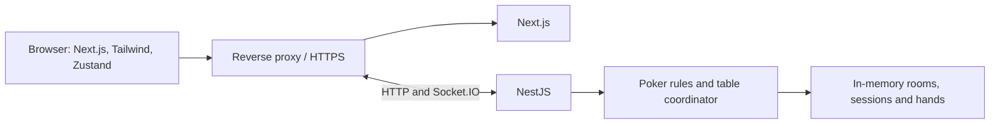

# Architecture — Poker Texas Hold'em

## Overview

Hệ thống là modular monolith gồm Next.js frontend và NestJS backend. Backend duy nhất sở hữu trạng thái phòng trong RAM và là nguồn quyết định mọi diễn biến game.

## Decisions

| Area                 | Decision                                                            |
| -------------------- | ------------------------------------------------------------------- |
| Runtime and language | Node.js 24 LTS and strict TypeScript                                |
| Workspace            | npm workspace with one lockfile                                     |
| Frontend             | Next.js App Router, Tailwind CSS, Zustand                           |
| Backend              | NestJS modular monolith; HTTP plus Socket.IO gateway                |
| State                | RAM only; no PostgreSQL, Prisma, cache, queue or object storage     |
| Authentication       | Opaque guest session in an HttpOnly cookie                          |
| Authorization        | Room member, host and active-player checks on every backend command |
| API                  | HTTP for room/session lifecycle; Socket.IO commands for gameplay    |
| Deployment           | One Docker Compose deployment behind Caddy on a VPS                 |

The frontend receives recipient-filtered, versioned snapshots. Game commands carry an id and the expected hand/turn so retrying or sending stale commands cannot apply an action twice. Reconnect always requests a fresh snapshot.

Game rules are a transport-independent TypeScript module inside the API. Frontend contracts contain only public state and the caller's private data; they never include another player's hole cards or undealt cards.

## Modules

| Module           | Responsibility                                                   |
| ---------------- | ---------------------------------------------------------------- |
| session-access   | Guest sessions, display names, room credentials and membership   |
| rooms            | Seats, fixed settings, host operations, pause and lifecycle      |
| chips            | Host grants, pending grants and conservation checks              |
| poker            | Deck, betting, hands, pots, settlement and positions             |
| realtime         | Connection ownership, deadlines, idempotency and synchronization |
| table-experience | Board UI, card privacy, rule help and animation                  |

## Operational defaults

- A turn expires after 180 seconds; timeout checks when legal, otherwise folds.
- After the first timeout in a hand, remaining turns auto-check/fold until the player explicitly returns; they sit out after the hand.
- A temporary disconnect preserves the seat, stack and deadline. A disconnected player is excluded from future hands.
- A disconnected host has 180 seconds to return; otherwise the room closes and an unfinished hand is cancelled.
- Pause applies after the current hand. Chip grants during a hand apply after settlement.
- Backend restart removes every room and session.

## Delivery and quality

Docker Compose runs Caddy, web and API containers. Only Caddy is public. CI, once hosted on GitHub, installs from the lockfile then runs lint, typecheck, tests, build and E2E. Logs are structured stdout logs without passwords, cookies, decks or private cards; health endpoints and basic room/connection/error metrics provide initial observability.
